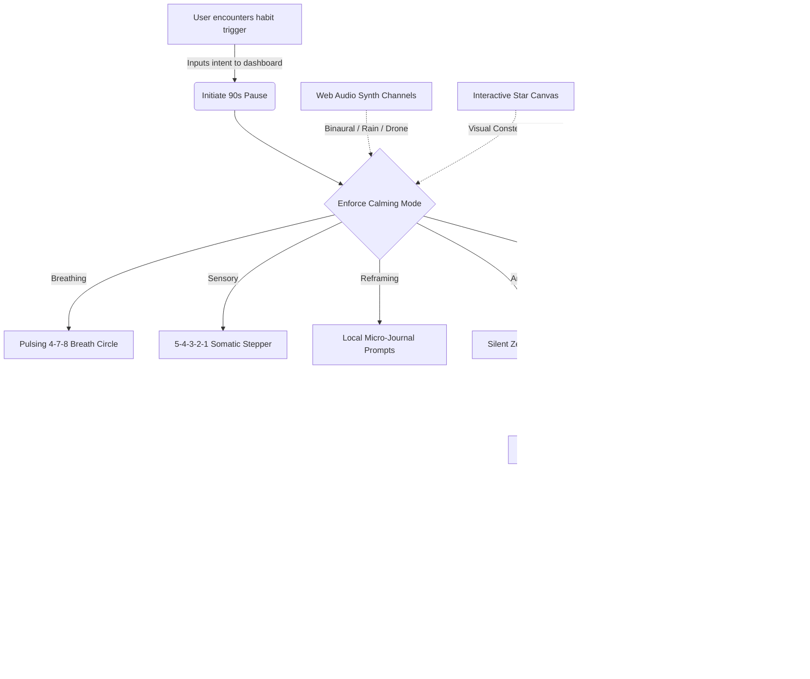

# 🌌 SoberMind // Autopilot Interrupter

> **Interrupt automatic behaviors, process dopamine cravings, and regain conscious control using the 90-Second Rule.**

SoberMind is a premium, high-aesthetic single-page web dashboard designed to intercept subconscious habits (like scrolling social media, boredom eating, or compulsive shopping). It combines interactive somatic grounding interfaces with synthetically generated, real-time ambient drone audio to guide your nervous system from reactivity back to cognitive clarity.

---

## ⚡ Quick Links
* **Live UI Layout:** [index.html](file:///D:/sobermind-interrupter/index.html)
* **Custom Stylesheet:** [style.css](file:///D:/sobermind-interrupter/style.css)
* **Audio & Logic Controller:** [app.js](file:///D:/sobermind-interrupter/app.js)

---

## 🧠 The Science: The 90-Second Rule
> *"When a person has a reaction to something in their environment, there’s a 90-second chemical process that happens; any remaining response is just the person choosing to stay in that loop."*  
> — **Dr. Jill Bolte Taylor, Harvard Neuroanatomist**

When an impulse fires, a chemical surge floods your system. If you do not feed the impulse with automatic thoughts, the physiological urge peaks and dissipates naturally within **90 seconds**. SoberMind creates a visual and somatic container to safely navigate this critical window.

---

## 🛠️ Key Architectural Features

| Module | Core Technology | Visual / Interactive Polish |
| :--- | :--- | :--- |
| **Constellation Particle Canvas** | HTML5 Canvas + Physics | Renders floating points with real-time neural connections drawn between close nodes. |
| **Calming Web Audio Synthesizer** | Web Audio API (Oscillators) | Generates **Binaural Theta (6Hz shift)**, **Synthetic Rain sweeps**, or **Deep Space Drone** dynamically without asset loads. |
| **Circular Countdown Ring** | SVG Vector Stroke Math | Progress ring depletion dynamically matched to clock ticks via `strokeDashoffset`. |
| **Grounding Steppers** | Interactive JS State Engine | Visual breathing guides (4-7-8 rhythm), Somatic 5-4-3-2-1 check-ins, and cognitive logs. |
| **Strict Mode Guard** | Javascript Lock Loop | Disables cancellation triggers after 15 seconds to prevent impulsive exits. |

---

## 🧬 System Flow & Interactions



---

## 🎨 Visual Aesthetics & Design System
SoberMind is crafted around a **sleek space-nebula glassmorphic aesthetic**:
- **Typography:** Display elements use the clean geometric font **Outfit** paired with **Inter** for crisp text layout.
- **Glassmorphic Cards:** High-contrast panels designed with `backdrop-filter: blur(25px)` and delicate borders (`rgba(255,255,255,0.07)`) floating over a deep space radial gradient.
- **Micro-Animations:** Fluid bezier scaling, pulsing breath circles, target sweeps, and glowing indicator states.

---

## 🚀 Setup & Launch

### 1. Direct Preview (No Installation Needed)
Since SoberMind is built using zero-dependency vanilla technologies, you can open the file [index.html](file:///D:/sobermind-interrupter/index.html) directly in any modern web browser to run the app immediately.

### 2. Local Serving (Development Server)
For live updates and development:
```bash
# Navigate to project folder
cd sobermind-interrupter

# Install developer dependencies (Vite)
npm install

# Run the development server
npm run dev
```
Open **`http://localhost:5174/`** in your browser to inspect the application.

---

## 📄 License
This project is licensed under the [MIT License](file:///D:/sobermind-interrupter/LICENSE). Feel free to customize and expand it as needed.
